```python
# from google.colab import drive
# drive.mount('/content/gdrive',force_remount=True)

import sys
from pathlib import Path
root = Path("./")
sys.path.append(str(root))
```


```python
import numpy as np
from pathlib import Path
import matplotlib as mpl
mpl.rc('image', cmap='gray', interpolation='none')
from matplotlib import pyplot as plt
from PIL import Image

np.random.seed(26)
```

# Partie 1 - Loi de Beer-Lambert, bruit, contrastes

## Jouer avec les projections...

### Loi de Beer-Lambert

Tout matériau est caractérisé par un *coefficient linéaire d'atténuation* $\mu$ qui a comme dimension l'inverse d'une longueur. A la traversée d'un milieu, l'intensité initiale d'un faisceau de rayons X ($I_0$) est atténuée selon la loi de Beer-Lambert suivante :
$$
I = I_0 \exp(-p),
$$
où :
$$
p = \int_L \mu(l)dl,
$$
et $L$ est la ligne suivie par les photons X. Nous raffinerons cette formule au fur et à mesure du cours, car cette modélisation est incomplète. A commencer par l'absence de bruit statistique ! En réalité, l'observation $I$ fluctue autour de la valeur donnée par la loi de Beer-Lambert selon une loi de Poisson :
$$
I \sim \mathcal{P}\left(I_0 \exp\left(-\int_L \mu(l)dl\right)\right).
$$

En pratique, si on mesure $I$, on s'intéresse plutôt à l'intégrale $p$, obtenue (lorsqu'on néglige le bruit) par passage au logarithme:
$$
p=\log(I_0)-\log(I).
$$

### Questions

1. Une loi de Poisson a pour densité de probabilité $P(X=k)=\frac{\lambda^k}{k!}e^{-\lambda}$. Calculer l'espérance et la variance d'une variable aléatoire suivant une loi de Poisson. Qu'en déduisez-vous sur l'évolution du SNR en fonction de $I_0$ ? (Faites le calcul !)
2. Ecrire une fonction `sumCols(img)` qui prend une image 2D en entrée et retourne le profil somme le long de l'axe vertical (l'axe des $x$ de l'image). A quoi correspond cette fonction dans la loi de Beer-Lambert ?
3. Ecrire une fonction `beerLambert(img,I0)` qui calcule le signal au détecteur après application de la loi de Beer-Lambert (avec sa statistique de Poisson) sur un profil 1D tel que sorti de `sumCols()`.

1.
$$
\begin{aligned}
E[X]&=\sum_{k=0}^{+\infty}kP(X=k)\\
&= \sum_{k=0}^{+\infty}k\frac{\lambda^k}{k!}e^{-\lambda}\\
&= e^{-\lambda}\sum_{k=1}^{+\infty}\frac{\lambda^k}{(k-1)!}\\
&= e^{-\lambda}\sum_{k=1}^{+\infty}\frac{\lambda^{k+1}}{k!}\\
&= \lambda e^{-\lambda}\underbrace{\sum_{k=0}^{+\infty}\frac{\lambda^k}{k!}}_{e^{\lambda}}
\end{aligned}\\
\boxed{E[X] = \lambda}\\
$$

$$
\sigma^2=\lambda
$$

3.


`sumCols(img)` $\to[\int_{c_1}\mu d, \int_{c_2}\mu d, \dots]$ car une integrale n'est rien d'autre qu'une somme


```python
# Question 2
def sumCols(img):
    """
    img est un np.ndarray (de dimension 2)
    sumCols(img) retourne un vecteur de même taille que le nombre de colonnes de img,
    chaque élément du vecteur étant égal à la somme des éléments de la colonne correspondante dans img
    """
    return np.sum(img, axis = 0)

# Question 3
def beerLambert(prof,I0):
    """
    prof est une sortie de sumCols()
    I0 est un paramètre correspondant à l'intensité dans l'air (feu nu)
    beerLambert(prof,I0) renvoie une réalisation de la loi de Beer-Lambert (statistique de Poisson)
    """
    return np.random.poisson(I0*np.exp(-prof))
```


```python
arr = np.array([[1, 2],[3, 4]])
arr, beerLambert(sumCols(arr), 1)
```


    (array([[1, 2],
            [3, 4]]),
     array([0, 0]))


### Questions

4. Lancez le code ci-dessous, qui génère une image synthétique composée d'un objet de "fond" (le grand carré) et d'une structure d'intérêt (le petit carré). Distinguez-vous bien le petit carré du grand carré à l'oeil nu?
5. Générez des profils de mesures selon la loi de Beer-Lambert (loi de Poisson), avec `I0 = 1e6`, `I0 = 1e4`, `I0 = 1e2`, et `I0 = 1`. Qu'observez-vous sur le profil d'atténuation ? sur le profil reconverti en log ?


```python
# Question 4

backgroundValue = 0.01
relativeContrast = 0.05

# Génération d'une image synhtétique
img = np.zeros((128,128))
img[32:-32,32:-32] += backgroundValue
img[48:-48,48:-48] += relativeContrast*backgroundValue

plt.figure()
plt.imshow(img)
plt.colorbar()
plt.show()
```


    
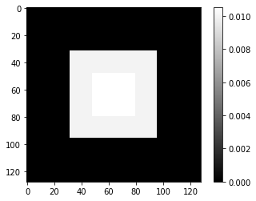
    


```python
# I0 = 1e6, 1e4, 1e2, 1
I0=1e6

# Question 5 : génération du profil d'atténuation
prof0 = sumCols(img)
attenuation = beerLambert(prof0, I0)

f,ax = plt.subplots(1,3,figsize=(18,4))
ax[0].plot(prof0,'-o')
ax[1].plot(attenuation,'-o')
# profil reconverti en log
prof = np.log(I0)-np.log(attenuation)
ax[2].plot(prof,'-o')
plt.show()
```


    

    


## Analyser les données de façon plus quantitative

Nous allons quantifier les phénomènes observés pour en tirer des conclusions plus solides. Le but de l'exercice est ici de comparer le niveau de contraste que l'on observe dans `img` entre le petit et le grand carré, et le niveau de "contraste" associé dans le profil issu de `sumCols(img)`. Aller chercher de façon plus ou moins automatique ce genre d'informations nécessite de savoir jouer un peu avec les signaux.

### Questions

6. Calculez (sans fonction toute faite) une différence finie d'ordre 1 : Si $p$ est le profil issu de `sumCols(img)`, alors la différence finie à l'indice $i$ est $g_i = p_{i+1}-p{i}$. Tracez le profil de la valeur absolue de cette différence finie : que fait-il ressortir ?
7. Nous allons extraire des informations de ce nouveau profil $g$. Utilisez la fonction `np.where` pour récupérer les points de $g$ qui correspondent à la zone projetée du grand carré.
8. Pouvez-vous répéter l'opération pour trouver les points correspondant à la projection du petit carré ?
9. Déduisez-en les calculs des quantités suivantes : valeur moyenne $B$ dans le "fond" (la projection du grand carré seul), valeur moyenne $C$ dans la "structure" (la projection du grand carré et du petit carré ensemble), écart-type $\sigma_B$ dans le "fond". Calculez les valeurs de contraste relatif $C_r$ et de CNR (https://howradiologyworks.com/x-ray-cnr/) définis comme suit :
$$
C_r = \frac{C-B}{B}, \quad \mathrm{CNR} = \frac{|C-B|}{\sigma_B}.
$$


```python
# Question 6 : différence finie d'ordre 1
def g(x):
    """
    g(x) calcule la différence finie "Euler forward"
    g(x)[i] = x[i+1]-x[i]
    """
    return x[1:]-x[:-1]

grad = np.abs(g(prof0))
plt.plot(grad)
```


    [<matplotlib.lines.Line2D at 0x7efe27a46490>]


    
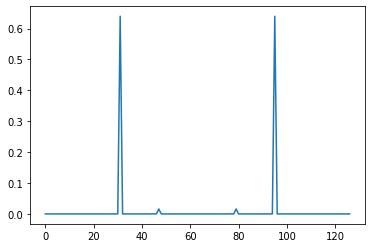
    


```python
# Question 7 : trouver les points de grad (et donc de prof0) qui correspondent à la projection du grand carré

bmin, bmax = np.where(grad > 0.9 * grad.max())[0]
bmin += 1

f,ax = plt.subplots()
ax.plot(range(bmin,bmax),prof0[bmin:bmax])
ax1=ax.twinx()
ax1.plot(range(bmin,bmax),grad[bmin:bmax],c='r',ls='--',alpha=0.4)
```


    [<matplotlib.lines.Line2D at 0x7efe27963070>]


    
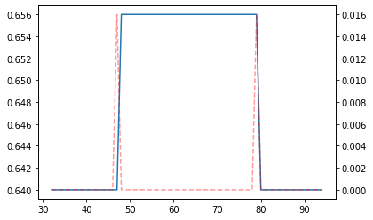
    


```python
# Question 8 : même principe, pour récupérer la zone de projection du petit carré

bmin1, bmax1 = np.where(grad[bmin:bmax] > 0.9 * grad[bmin:bmax].max())[0]
bmin1 += bmin + 1
bmax1 += bmin 

plt.plot(range(bmin1,bmax1),prof0[bmin1:bmax1])
```


    [<matplotlib.lines.Line2D at 0x7efe278dd4c0>]


    
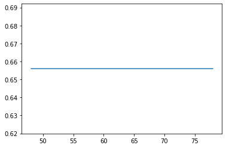
    


```python
# Question 9 : Construction des zones d'intérêt du profil
# [u00,u01[ : zone de fond gauche
# [u10,u11[ : zone de contraste
# [u20,u21[ : zone de fond droite

margin = 5
u00 = bmin + margin
u01 = bmin1 - margin
u10 = bmin1 + margin
u11 = bmax1 - margin
u20 = bmax1 + margin
u21 = bmax - margin

plt.plot(range(bmin,bmax),prof0[bmin:bmax])
plt.plot(range(u00,u01),prof0[u00:u01],c='r',lw=5)
plt.plot(range(u10,u11),prof0[u10:u11],c='g',lw=5)
plt.plot(range(u20,u21),prof0[u20:u21],c='r',lw=5)
```


    [<matplotlib.lines.Line2D at 0x7efe278c1d60>]


    
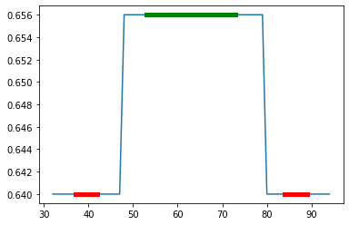
    


```python
# Question 9 (suite) : calcul du contraste relatif et du CNR sur prof
background = np.concatenate([prof[u00:u01], prof[u20:u21]])
backgroundEstimate = background.mean() # B
backgroundNoiseEstimate = background.std() # C
contrastEstimate = prof[u10:u11].mean() # teta_b
relativeContrast = (backgroundNoiseEstimate - backgroundEstimate) / backgroundEstimate # Cr = (C - B) / B
cnr = np.abs(backgroundNoiseEstimate - backgroundEstimate) / contrastEstimate # CNR = |C - B| / teta_b 
print('Relative contrast:',np.round(relativeContrast,3))
print('CNR:',np.round(cnr,3))
```

    Relative contrast: -0.998
    CNR: 0.975


## Partie 1 : Ce qu'il faut retenir

- Il est plus facile d'identifier un contraste dans une image que dans une projection
- Le bruit de Poisson rend la tâche d'identification de faibles contrastes dans les projections encore plus difficile
- Le bon côté du bruit de Poisson, c'est que le bruit augmente moins vite que le signal avec $I_0$: ainsi le SNR s'améliore lorsque $I_0$ augmente
- Une image en dynamique exponentielle est difficile à lire: on préfère récupérer une dynamique plus linéaire en passant au log

# Partie 2 - Chaîne de traitement d'une image de radiographie numérique

Une image brute lue au détecteur à rayons X est loin d'être acceptable pour un radiologue ; dans cette partie, nous allons explorer la chaîne de traitement appliquée sur une image brute afin de la préparer à être présentée au radiologue.

Chargez l'image mesurée au détecteur : c'est une image inexploitable en l'état ! "Bad pixels", non-uniformités du fond, dynamique exponentielle... Cette image a besoin d'être traitée avant d'être regardable.


```python
I0 = 1e6
fn = Path("homer_measurement_noisy.704.640.raw")
measurement = np.fromfile(fn,dtype='float32').reshape((704,640))
plt.imshow(measurement)
plt.axis('off')
plt.show()
```


    
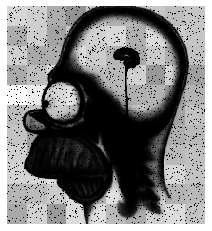
    


## Correction d'offsets, de gains, bad pixels

En théorie, lorsque la loi de Beer-Lambert annonce que l'on doit (au bruit près) mesurer une valeur $I$ au détecteur, on s'attend à ce que la mesure soit égale à $I$. En pratique, ce n'est pas le cas : le plus souvent, on considère que la mesure est une fonction affine de la valeur théorique : $I_m = aI+b$. Cette fonction affine est **différente pour chaque pixel**.

On appelle *offsets*, les valeurs qui sortent d'un détecteur alors qu'il n'est pas exposé aux rayons X : en théorie, le détecteur devrait retourner une image noire (zéros) ; en pratique, l'électronique du détecteur, les défauts de conception, font que l'image non exposée n'est pas nulle. Les offsets correspondent donc au paramètre $b$ de la fonction linéaire.

Lorsque le détecteur n'est pas exposé aux rayons X, il peut lire à vide plusieurs images à la suite : c'est à partir de ces lectures multiples que l'on peut estimer une carte d'offsets $b$.

De même, lorsque l'on exposre uniformément le détecteur sans objet dans le champ, on s'attend à mesurer une intensité constante au détecteur *après soustraction des offsets* ; en pratique, on mesure $I_m-b=aI$, là encore, avec des valeurs de $a$ différentes par pixel.

Une lecture multiple du détecteur exposé aux rayons X peut permettre d'estimer la carte des gains $a$.

Les "bad pixels" sont des pixels du détecteur qui ne répondent tout simplement plus ; il y en a forcément, car malgré toutes les précautions lors de la production et de l'acheminement des détecteurs, il est impossible de garantir l'infaillibilité de tous les pixels du détecteur. Heureusement, il est possible d'identifier la position de ces bad pixels, et d'interpoler les valeurs à partir des pixels voisins.


### Questions

1. Chargez la série d'images de lectures à vide du détecteur ; affichez la première image de la série : que voyez-vous ? Qu'est-ce qui diffère d'une image à l'autre ?
2. Proposez une estimation de la carte d'offsets à partir de cette série d'images; corrigez la mesure en offsets : voyez-vous beaucoup de différences entre l'image corrigée et non corrigée ? pourquoi ?


```python
# Question 1

fn = Path(root/"offsetMapAcq.50.704.640.raw")
offsetMapAcq = np.fromfile(fn,dtype='float32').reshape((50,704,640))
plt.imshow(offsetMapAcq[0])
plt.colorbar()
plt.axis('off')
plt.show()
```


    

    


*D'ou vient ce bruit ?*
> Il y a un bruit inherent a l'electronique du detecteur


```python
# Question 2

offsetMap = offsetMapAcq.mean(axis = 0)
plt.imshow(offsetMap,interpolation='none',cmap='gray')
plt.axis("off")
plt.colorbar()
plt.show()
```


    

    


```python
# Question 2 (suite)

f,ax = plt.subplots(1,2)
ax[0].imshow(measurement,cmap='gray',interpolation='none')
ax[0].set_axis_off()
ax[0].set_title('Measurement')
ax[1].imshow((measurement-offsetMap).clip(min=0),cmap='gray',interpolation='none')
ax[1].set_axis_off()
ax[1].set_title('Offset-corrected')
```


    Text(0.5, 1.0, 'Offset-corrected')


    

    


### Question

3. Chargez la série d'images de lectures du détecteur uniformément exposé ; proposez une estimation de la carte d'offsets à partir de cette série d'images, et corrigez la mesure en gain : qu'observez-vous ?


```python
# Question 3

fn = Path(root/"gainMapAcq.50.704.640.raw")
gainMapAcq = np.fromfile(fn,dtype='float32').reshape((50,704,640))
plt.imshow(gainMapAcq[0])
plt.axis('off')
plt.colorbar()
plt.show()

gainMap = (gainMapAcq - offsetMap).clip(min=0).mean(axis = 0)
gainMap /= np.median(gainMap)
plt.imshow(gainMap,interpolation='none',cmap='gray')
plt.axis("off")
plt.colorbar()
plt.show()
```


    
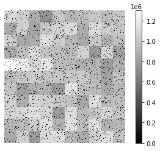
    


    
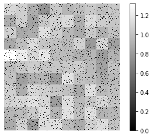
    


```python
# Question 3 (suite)

tmp = (measurement - offsetMap).clip(min=0) / gainMap
plt.imshow(tmp,cmap='gray',interpolation='none')
plt.axis("off")
plt.show()
```

    <ipython-input-17-a5367ba78078>:3: RuntimeWarning: invalid value encountered in true_divide
      tmp = (measurement - offsetMap).clip(min=0) / gainMap


    
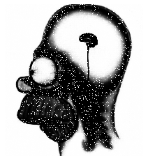
    


### Question

4. Proposez une détection des pixels "morts" (bad pixels) ; comparez votre détection à la carte des bad pixels que vous aurez chargé. Terminez la correction de l'image déjà corrigée en offsets et en gains, en fournissant la carte des bad pixels à la fonction d'inpainting.


```python
# Question 4

# (...)
badPixelMap = (offsetMap == 0)
plt.imshow(badPixelMap,interpolation='none')
plt.axis("off")
plt.show()

fn = Path(root/"badPixels.704.640.raw")
badPixels = np.fromfile(fn,dtype='float32').reshape((704,640))
plt.imshow(badPixels-badPixelMap)
plt.axis("off")
plt.show()
```


    
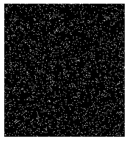
    


    

    


```python
# Question 4 (suite)

import cv2
tmp[badPixelMap==1] = 0
output = cv2.inpaint(tmp.astype('float32'), badPixelMap.astype('uint8'), 1, cv2.INPAINT_NS)

plt.imshow(output,interpolation='none',cmap='gray')
plt.colorbar()
plt.axis("off")
plt.show()
```


    

    


### Question

5. Chargez la détection "idéale" ; comparez l'image idéale et l'image corrigée : qu'observez-vous ?


```python
# Question 5

fn = Path(root/"Inoisy.704.640.raw")
I = np.fromfile(fn,dtype='float32').reshape((704,640))
res = (output-I)/I
plt.imshow(res,vmin=res.mean()-3*res.std(),vmax=res.mean()+3*res.std())
plt.colorbar()
plt.axis("off")
plt.show()
```

    <ipython-input-20-63d627f3aeb6>:5: RuntimeWarning: divide by zero encountered in true_divide
      res = (output-I)/I
    <ipython-input-20-63d627f3aeb6>:5: RuntimeWarning: invalid value encountered in true_divide
      res = (output-I)/I


    

    


## Transformation log

Rappelez-vous que la loi de Beer-Lambert fournit $I=I_0e^{-p}$ ; puisque $p$ est la quantité réellement intéressante, on transforme les mesures suivant : $$p = \log(I_0)-\log(I).$$

### Questions

6. Transformez l'image corrigée via l'équation précédente ; afin de ne pas appliquer le log à zéro, utilisez la fonction `np.clip` pour clipper les valeurs inférieures à $10^{-3}$. Qu'observez-vous ?
7. Définissez une fonction `linlog(x,x0)` qui correspond au logarithme de $x$ au-delà d'un seuil $x_0$, et qui se prolonge linéairement jusqu'à zéro avec continuité des pentes.

8. Transformez l'image corrigée en utilisant cette nouvelle fonction : le résultat est-il plus convaincant ?


```python
# Question 6

plt.imshow(np.log(I0)-np.log(output.clip(min=1e-3)))
plt.axis("off")
plt.colorbar()
plt.show()
```


    

    


Des qu'on arrive dans des zones petites, notre lof *s'effondre*, d'ou le bruit blanc.
C'est pour ca qu'on prefere linearise le $\log$ pour avoir des pentes plus douces


```python
# Questions 7 & 8

def linlog(x,x0):
    """
    linlog(x,x0) est un logarithme naturel standard au-dessus de x0
    En-dessous de x0, linlog(x,x0) est linéaire, avec une continuité de pentes en x0
    """
    x0 = float(x0)
    x = float(x) if isinstance(x,(int,float)) else x.astype(float)
#     return np.where(x >= x0, np.log(x), (1/x0)*x)
    return np.where(x >= x0, np.log(x), (1/x0) * x + np.log(x0)-1)  # ax + b

plt.figure()
x = np.linspace(0,10,1000)
x0 = 3
plt.plot(x[1:],np.log(x.max())-np.log(x[1:]),label='log')
plt.plot(x,np.log(x.max())-linlog(x,x0),label='linlog')
plt.axvline(x0,0,1,color='k',ls='dashed')
plt.legend()
plt.show()

outLog = np.log(I0)-linlog(output,x0)
plt.imshow(outLog)
plt.colorbar()
plt.axis("off")
plt.show()
```

    <ipython-input-23-34dfaf741c3b>:11: RuntimeWarning: divide by zero encountered in log
      return np.where(x >= x0, np.log(x), (1/x0) * x + np.log(x0)-1)  # ax + b


    

    


    <ipython-input-23-34dfaf741c3b>:11: RuntimeWarning: divide by zero encountered in log
      return np.where(x >= x0, np.log(x), (1/x0) * x + np.log(x0)-1)  # ax + b


    

    


```python
f,ax = plt.subplots(1,2)
ax[0].imshow(measurement,cmap='gray',interpolation='none')
ax[0].set_axis_off()
ax[1].imshow(outLog,cmap='gray',interpolation='none')
ax[1].set_axis_off()
```


    

    


On a moins de bruit et on recupere des infos interessantes.

## Partie 2 : Ce qu'il faut retenir

- Une image brute doit être traitée avant d'être présentée à l'utilisateur
- Ces traitements comprennent généralement une correction en offsets et en gains, et une correction de bad pixels
- Ces corrections sont issues de procédures de calibration *offline*, fournissant des informations utilisées ensuite *online* sur les images
- La transformation via le logarithme peut poser problème dans les zones de faible exposition : dans ce cas, un logarithme linéarisé dans les faibles valeurs est pertinent

# Partie 3 - Contrôle automatique de l'exposition (AEC)

Le principe ALARA (as low as reasonably achievable, de plus en plus remplacé par le terme ALADA -- as low as diagnostically achievable) signifie que si l'on doit fournir une dose importante là où on en a besoin (et où l'analyse bénéfice/risque est en faveur de cette exposition aux radiations), en revanche il faut à tout prix réduire la dose de rayonnements ionisants lorsque celle-ci n'apporte rien d'un point de vue clinique. C'est dans cette optique que les techniques de contrôle automatique de l'exposition (automatic exposure control, ou AEC) ont été développées dans différentes modalités.

Dans l'exemple qui suit, on se place dans le cadre d'une adaptation *ligne à ligne* de l'exposition du patient ; cela peut être le résultat d'un filtre physique qui s'adapterait en sortie du tube, ou d'un système à balayage qui scannerait ligne à ligne.

Supposons que les structures d'intérêt soient "correctement" centrées au niveau du détecteur ; le bruit au détecteur dépendant de la ligne intégrale traversée $p$, si l'on veut garantir un niveau de bruit supérieur ou égal à un niveau cible sur une ligne du détecteur, il faut identifier la zone "centrée" la plus radio-opaque de cette ligne. En répétant cette recherche ligne à ligne, on obtient des points $\{p_{\max,i}\}_i$ qui nous définissent une courbe caractéristique $t$.

## Questions

1. Re-définissez l'image idéale $p$ à partir de `I` et `I0` ; pour chaque ligne, récupérez le maximum de cette ligne *dans le tiers central*, ainsi que les indices des points réalisant ce maximum. Tracez le profil résultant de cette opération.
2. Lissez ce profil à l'aide d'un filtre à moyenne glissante : il s'agit d'une convolution par un noyau constitué uniquement de 1. Utilisez une taille de 32 pour le noyau.


```python
# Question 1

fn = Path(root/"Inoisy.704.640.raw")
I = np.fromfile(fn,dtype='float32').reshape((704,640))

img = np.log(I0) - linlog(I, 3)
n = 3
idx = img.shape[1] // n + img[:,img.shape[1] // n : (n-1) * img.shape[1] // n].argmax(axis=1)
integrals = np.array([img[k,idx[k]] for k in range(img.shape[0])])
plt.figure()
plt.plot(integrals)
plt.xlabel('Row number (from top to bottom)')
plt.ylabel('Max value (in central area)')
plt.show()
```

    <ipython-input-23-34dfaf741c3b>:11: RuntimeWarning: divide by zero encountered in log
      return np.where(x >= x0, np.log(x), (1/x0) * x + np.log(x0)-1)  # ax + b


    
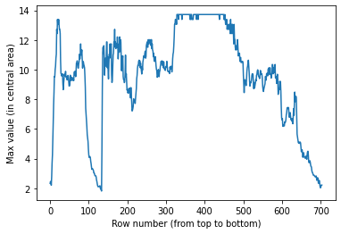
    


```python
# Question 1 (complément)

plt.imshow(I)
plt.scatter(idx,np.arange(I.shape[0]),c='r',s=2)
plt.show()
```


    
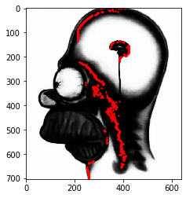
    


```python
# Question 2
size = 32
kernel = np.ones(size) / size 
window = size//2
integrals = np.convolve(np.pad(integrals,(window,window),'edge'),kernel,'same')[window:-window]
f,ax = plt.subplots()
ax.imshow(img.T)
ax1 = ax.twinx()
ax1.plot(integrals,'r',lw=3)
plt.show()
```


    
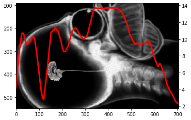
    


## Questions

3. Utilisez les mêmes coordonnées de l'image pour tracer le profil des signaux détecteurs de `I`. Varient-ils beaucoup ?
4. Vous avez jusqu'ici travaillé en supposant $I_0$ constant pour toute l'image : on parle d'exposition constante ou uniforme. Essayez maintenant d'adapter les paramètres de tir d'une ligne à l'autre de l'image, afin de ramener le profil que vous venez de tracer constant autour de 100. On va donc adapter la valeur de $I_0$ d'une ligne à l'autre. Pouvez-vous déterminer ce profil de modulation `I0Vector`, de la taille de la hauteur de l'image ? En supposant que le kVp reste fixe, quelle quantité physique est ainsi modulée ?


```python
# Question 3

detectorSignal = np.array([I[k, idx[k]] for k in range(idx.size)])
plt.plot(detectorSignal)
plt.yscale('log')
plt.xlabel('Image row (top to bottom)')
plt.ylabel('Detector signal')
plt.title('Signal profile')
plt.show()
```


    
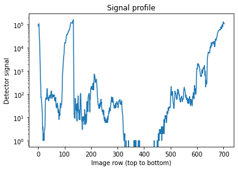
    


On a un profile qui va essayer de baisser les valeurs la ou on a sous-expose et les augmenter la ou on a sur-expose.

On a $p_i=\int udl$ qui est l'epaisseur

Le profil au-dessus est 

$$
I_n=I_0^{\text{(red)}}e^{-p}
$$

$$
I\simeq \text{target}
$$


```python
# Question 4

targetSignal = 100
I0Vector = targetSignal * np.exp(integrals)
plt.plot(I0Vector)
plt.xlabel('Image row (top to bottom)')
plt.ylabel('$I_0$ value')
plt.show()
```


    
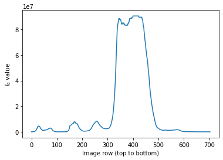
    


Par rapport a notre image avec la courbe et Homer, quand on regarde le profil d'epaisseur, on se rend compte que la dynamique est faible $\in[3;14]$. Il faut un peu plus d'epaisseur pour en tirer le maximum et obtenir le meilleur resultat possible.

## Questions

5. Etant donnés $p$ et le vecteur de modulation $I_0$, simulez l'image ainsi acquise (sans ajout de bruit).
6. Tracez le profil des signaux détecteurs de `I` avec cette nouvelle acquisition. Comparez-le au profil qui aurait été obtenu avec un $I_0$ fixe égal à la moyenne du vecteur de modulation. Qu'observez-vous ?
7. Estimez le niveau de réduction de dose par rapport à une acquisition à techniques fixes lorsque : (a) $I_0$ est constant égal au maximum des valeurs du vecteurs de modulation ; (b) $I_0$ est constant égal à la valeur moyenne du vecteur de modulation. A quoi correspondent ces deux cas ?


```python
# Question 5

Imod = I0Vector[:,None] * np.exp(-img)
f,ax = plt.subplots(1,2)
ax[0].imshow(I,cmap='gray',interpolation='none')
ax[0].set_title('Unmodulated')
ax[0].set_axis_off()
ax[1].imshow(Imod,cmap='gray',interpolation='none')
ax[1].set_title('Modulated')
ax[1].set_axis_off()
```


    
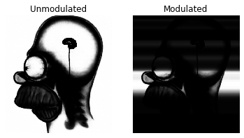
    


```python
# Question 6

plt.plot([Imod[k,idx[k]] for k in range(idx.size)],label='With modulation')
plt.plot([I[k, idx[k]] / I0 * I0Vector.mean() for k in range(idx.size)],label='Without modulation')
plt.axhline(targetSignal,0,1,color='r',ls='dashed')
plt.yscale('log')
plt.xlabel('Image row (top to bottom)')
plt.ylabel('Detector signal')
plt.title('Signal profile')
plt.legend()
plt.show()
```


    
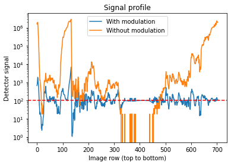
    


```python
# Question 7

cumulativeI0 = np.trapz(I0Vector)

# Cas (a)
cumulativeI0FixedMax = cumulativeI0.max()
# Cas (b)
cumulativeI0FixedMean = cumulativeI0.mean()

print('Case (a): dose reduction of', np.round(100*(1-cumulativeI0/cumulativeI0FixedMax),2),'%')
print('Case (b): dose reduction of', np.round(100*(1-cumulativeI0/cumulativeI0FixedMean),2),'%')

plt.figure()
plt.plot(I0Vector)
plt.axhline(I0Vector.max(),0,1,color='k',ls='dashed')
plt.axhline(I0Vector.mean(),0,1,color='r',ls='dashed')
plt.xlabel('Image row (top to bottom)')
plt.ylabel('$I_0$ value')
plt.show()
```

    Case (a): dose reduction of 0.0 %
    Case (b): dose reduction of 0.0 %


    
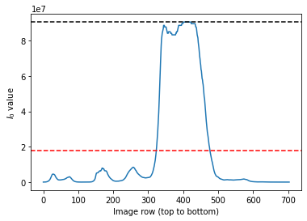
    


## Partie 3 : Ce qu'il faut retenir

- Le principe ALARA (ALADA) est à l'origine des développements récents en stratégies AEC
- Le but est d'atteindre un signal cible au détecteur, gage d'un niveau de qualité, et de moduler l'exposition en conséquence
- Tirer à techniques fixes avec la valeur moyenne de modulation revient à utiliser la même dose, mais distribuée de façon non optimale (sous-exposition à certains endroits, sur-exposition à d'autres)
- EOSedge est le premier système d'imagerie RX à balayage intégrant une stratégie AEC : la Flex Dose


# Partie 4 - Diffusé et qualité image

En première approximation, le rayonnement diffusé peut être vu comme un signal additionnel basse fréquence du signal initial (dit primaire). Si $I$ est le rayonnement primaire, et $S$ le rayonnement diffusé, l'intensité mesurée au détecteur est $I_{s}=I+S$.

## Questions

1. Quel est l'effet du diffusé $S$ sur l'estimation de la ligne intégrale $p=\log(I_0)-\log(I_s)$ ? Qu'en déduisez-vous sur le niveau de gris moyen dans l'image $p$ par rapport à l'image idéale $p_{\mathrm{true}} = \log(I_0)-\log(I)$ ?
2. A l'aide de la fonction `cv2.GaussianBlur`, filtrez l'image `I` avec un noyau isotrope de taille 51, et multipliez-la par 0.1. Appelez cette nouvelle image `S` : ce sera notre image de diffusé. Ajoutez ce diffusé à l'image primaire `I` : appelez `Iscatter` cette nouvelle image. Générez une réalisation de bruit de Poisson associée à cette image corrompue par du diffusé. De même, générez une réalisation de bruit de Poisson associée à l'image *non corrompue* `I`.
3. Ecrivez une fonction qui applique la transformation log vue précédemment. Transformez l'image `Iscatter` : qu'observez-vous par rapport à la transformation de `I` ?
4. Supposez que vous connaissez la carte de diffusé (c'est le cas ici, puisqu'on l'a générée) ; soustrayez-la à votre acquisition corrompue : que donne l'image en log par rapport à l'image en log corrompue ? par rapport à l'image en log idéale ? Comment expliquez-vous ce résultat ?


```python
fn = Path(root/"I.704.640.raw")
I = np.fromfile(fn,dtype='float32').reshape((704,640))

# Question 2

S = (...)
Iscatter = I+S

Iscatter = (...) # add noise to Iscatter
InoScatter = (...) # add noise to I

f,ax = plt.subplots(1,3,figsize=(18,6))
ax[0].imshow(I)
ax[0].set_axis_off()
ax[0].set_title('$I$')
ax[1].imshow(S)
ax[1].set_axis_off()
ax[1].set_title('$S$')
ax[2].imshow(Iscatter)
ax[2].set_axis_off()
ax[2].set_title('$I_s=I+S$')
plt.show()
```


```python
# Question 3

def logCompress(img):
    return (...)

# Vous pouvez sélectionner une sous-région anatomique ou `full` pour voir toute l'image
brain = slice(100,300),slice(300,500)
cervicals = slice(350,600), slice(300,500)
teeth = slice(400,600), slice(100,300)
full = slice(None,None)
# Choisissez la région que vous voulez dans `anat`
anat = brain

# Questions 3 et 4

pTrue = logCompress(InoScatter)
pScatter = logCompress(Iscatter)
pScatterCorrected = logCompress((...))

vmin,vmax = pTrue.min(), pTrue.max()

f,ax = plt.subplots(1,3,figsize=(18,6))
ax[0].imshow(pTrue[anat],vmin=vmin,vmax=vmax)
ax[0].set_axis_off()
ax[0].set_title('True image')
ax[1].imshow(pScatter[anat],vmin=vmin,vmax=vmax)
ax[1].set_axis_off()
ax[1].set_title('Scatter-corrupted')
ax[2].imshow(pScatterCorrected[anat],vmin=vmin,vmax=vmax)
ax[2].set_axis_off()
ax[2].set_title('Scatter-corrected')
plt.show()
```

## Partie 4 : Ce qu'il faut retenir

- Le rayonnement diffusé est une image basse fréquence qui se superpose au rayonnement primaire
- Le diffusé conduit à une diminution du contraste global de l'image
- La correction numérique du diffusé (après acquisition) permet de restaurer le contraste de l'image, mais conduit aussi à une image plus bruitée
- Afin de présenter une image plus acceptable à l'utilisateur final, il faut prendre en compte ce phénomène, soit en amont (réjection du diffusé avant qu'il atteigne le détecteur) ou en aval (correction de diffusé et débruitage)


```python

```
